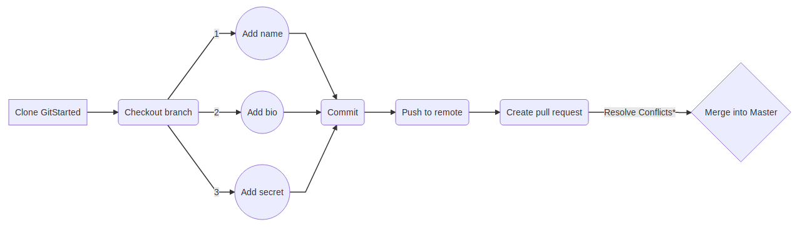
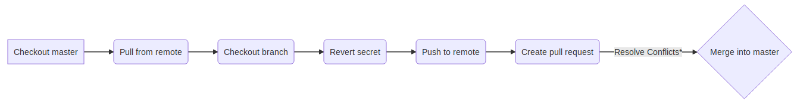

# Git Started!


## Pre-mission requirement

### _Install Git onto your device_
**Linux**
- [Debian](https://www.debian.org/):
	```
	sudo apt-get install git
	```
**Mac OS**
- [.dmg installer](https://sourceforge.net/projects/git-osx-installer/files/)
- [Brew](https://brew.sh/):
	```
	ruby -e "$(curl -fsSL https://raw.githubusercontent.com/Homebrew/install/master/install)"
	brew install git
	```
**Windows**
- [.exe installer](https://gitforwindows.org/)

## Today's mission
To learn the basics of **version control** by editing a single file simultaneously with many others!

### _Part 1_
Complete the following Katacoda Scenarios :
1. [Committing Files](https://www.katacoda.com/courses/git/1)
2. [Committing Changes](https://www.katacoda.com/courses/git/2)
3. [Working Remotely](https://www.katacoda.com/courses/git/3)
4. [Undoing Changes](https://www.katacoda.com/courses/git/4)
5. [Fixing Merge Conflicts](https://www.katacoda.com/courses/git/5)
6. [Experiments Using Branches](https://www.katacoda.com/courses/git/6)


### _Part  2_
Clone a copy of this repository and some add information about yourself to [Members.md](https://github.com/DSC-MtA/Git-Started), and include a secret!

 &nbsp;&nbsp;&nbsp;&nbsp;_For your bio information, include your academic year, focus of study, and home town/city._



### _Part 3_

Hide your secret using the powers of **version control!**



### _Part 4_
Explore this repositories commit history to look at your changes and learn about your fellow _DSC_ members!

## 🛠️ Recommended  tools 🛠️

**Create a branch**

&nbsp;&nbsp;&nbsp;&nbsp; `git branch <name of branch>`

**Checkout a branch**

&nbsp;&nbsp;&nbsp;&nbsp; `git checkout <name of branch>`

**Create and checkout a branch**

&nbsp;&nbsp;&nbsp;&nbsp; `git checkout -b <name of branch>`

**Pull changes from remote branch into local branch**

&nbsp;&nbsp;&nbsp;&nbsp; `git pull`

**Stage a file**

&nbsp;&nbsp;&nbsp;&nbsp; `git add <name of file>`

**Commit a file**

&nbsp;&nbsp;&nbsp;&nbsp; `git commit -m "a commit message"`

**Push a file to a new remote branch**

&nbsp;&nbsp;&nbsp;&nbsp; `git push --set-upstream origin <name of branch>`

**Push a file to an existing remote branch**

&nbsp;&nbsp;&nbsp;&nbsp; `git push`

**Revert a commit**

&nbsp;&nbsp;&nbsp;&nbsp; &nbsp;&nbsp;`git revert <commit hash>`


&nbsp;&nbsp;&nbsp;&nbsp; &nbsp;&nbsp;`git config credential.helper store`
